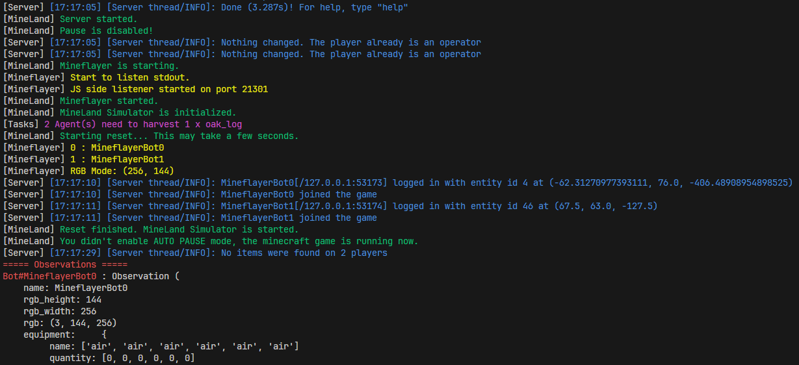

<div align="center">
    <h1> MineLand </h1>
    <h4> Simulating Large-Scale Multi-Agent Interactions with Limited Multimodal Senses and Physical Needs </h4>
</div>


**MineLand** is a multi-agent Minecraft simulator with large-scale interactions, limited multimodal senses and physical needs, all contribute to more ecological and nuanced collective behaviors. MineLand simulator supports up to 48 agents with limited visual, auditory, and environmental awareness, forcing them to actively communicate and collaborate to fulfill physical needs like food and resources. This fosters dynamic and valid multi-agent interactions. We also designed an AI Agent based on MineLand - **Alex**, inspired by multitasking theory, enabling agents to handle intricate coordination and scheduling.

You can check [our paper](https://arxiv.org/abs/2403.19267) for further understanding, and MineLand and Alex code is provided in this repo.

Please note that our paper and code are currently a **Work In Progress** and will be undergoing continuous iterations and updates **in the coming months**. Therefore, **the API is NOT stable** and may change in the future! If you have any questions or suggestions, please raise them in the issues.

# 0. Contents

- [0. Contents](#0-contents)
- [1. Installation](#1-installation)
  - [1.1 Prerequisites](#11-prerequisites)
  - [1.2 Installation](#12-installation)
  - [1.3 Verification](#13-verification)
- [2. Quick Start](#2-quick-start)
- [3. Our Paper](#3-our-paper)

# 1. Installation

You can refer to the [Installation Docs](./docs/installation.md) and [Q&A](./docs/q&a.md) for more detailed installation guidelines.

## 1.1 Prerequisites

MineLand requires Python 3.11, Node.js 18.18 and Java 17

## 1.2 Installation

We highly recommend installing MineLand in a virtual environment (such as Anaconda)

```bash
git clone git@github.com:cocacola-lab/MineLand.git
cd MineLand

pip install -e .

cd mineland/sim/mineflayer
npm install
```

## 1.3 Verification

```bash
cd scripts
python validate_install_simulator.py
```

You will see `Validation passed! The simulator is installed correctly.`, if MineLand simulator installed properly.

# 2. Quick Start

MineLand provides a set of [Gym-style](https://www.gymlibrary.dev/) interfaces, similar to other simulators like [MineDojo](https://github.com/MineDojo/MineDojo). The following is a minimal example code.

```python
import mineland

mland = mineland.make(
    task_id="survival_0.01_days",
    agents_count = 2,
)

obs = mland.reset()

for i in range(5000):
    act = mineland.Action.no_op(len(obs))
    obs, code_info, event, done, task_info = mland.step(action=act)
    if done: break

mland.close()
```

You can refer to [MineLand Docs](./docs/api.md) or the code under the `./scripts` directory for development.

MineLand does NOT have a minecraft game client for higher efficiency. You can obtain the current visual information of the agents from `obs`, or connect to the server using a vanilla Minecraft 1.19 client. The server operates locally with the default port, which means you can directly connect to `localhost:25565` in the game to enter the server.

Environment Preview


# 3. Our Paper

Our paper is available on [Arxiv](https://arxiv.org/abs/2403.19267).

```bibtex
@misc{yu2024mineland,
      title={MineLand: Simulating Large-Scale Multi-Agent Interactions with Limited Multimodal Senses and Physical Needs}, 
      author={Xianhao Yu and Jiaqi Fu and Renjia Deng and Wenjuan Han},
      year={2024},
      eprint={2403.19267},
      archivePrefix={arXiv},
      primaryClass={cs.CL}
}
```
